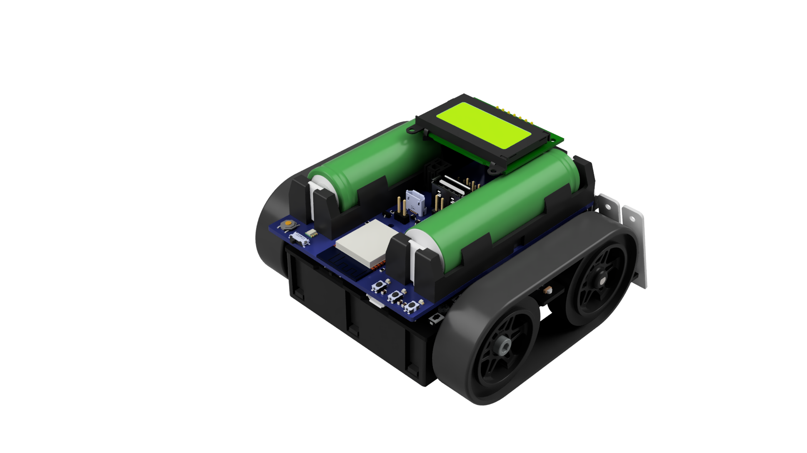
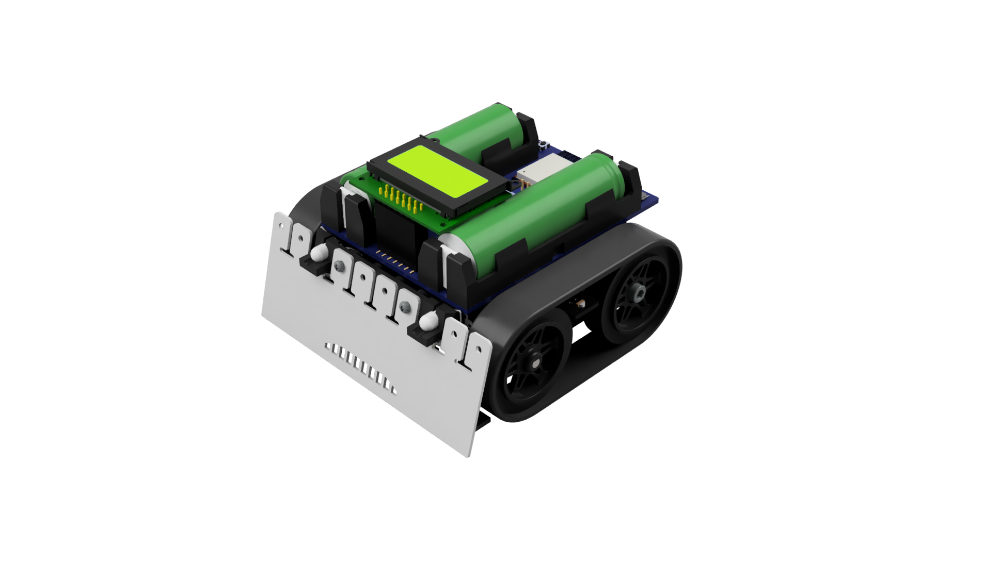
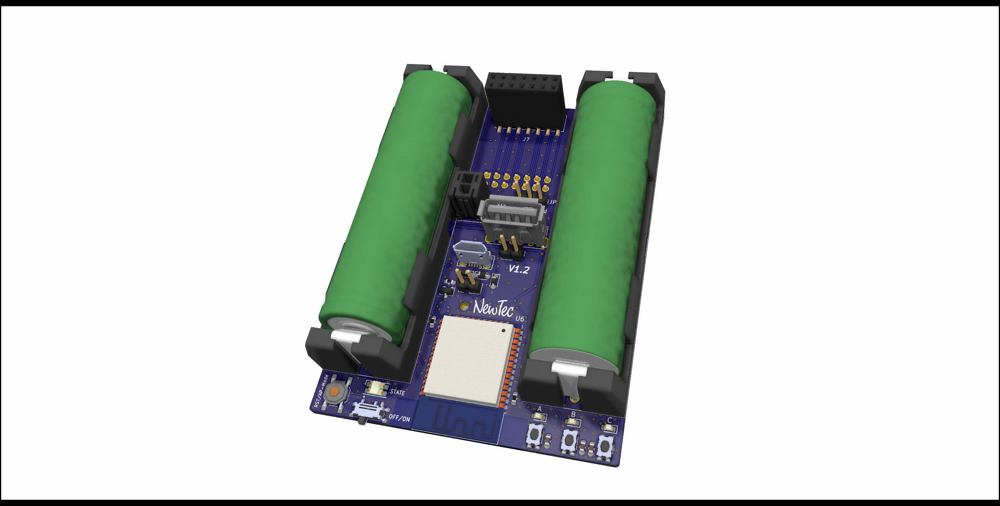

# Hardware
!!!ATTENTION!!! 
 
Do NOT use v1.1 -> use v1.2 (or higher) instead

  

## Design

## Features
* Status LED
* 2x 18650 Lithium-Ion batteries
* Off/On-Switch
* Reset/AP-Mode-Button
* User-Buttons (A,B,C)
* User-LEDs (A,B,C) -> mirror mode
* BMS included
* Battery voltage measurement
* RESET-Jumper for BMS

  

## Toolchain
* KiCad (v5.1.6)

  

## Changelog 
### v1.2
* pad size from L2 increased (again)
* Jumper for BMS-reset added
* State LED to 3V3 (istead to 5V) connected
* order from LEDs (egual to ZumoRobot >>> same color) adapted
* connection between LEDs A, B and C and the ESP removed. Routed them to mirror the LEDs on the Zumo 
* Main-Switch circuit removed
* all Pins from the Display through connected
* Battery voltage measurement to pin 35 connected >>> LEDs/Buttons got a new pin on ESP32

 

### v1.1 (15.08.2022)

#### Power supply
* Mosfet Q1 does not switch off. >>> voltage divider and select other MOSFET removed

#### Voltage regulator 5V:
* /SHDN pin connected to VOut >>> must be connected to VIN (do not solder pin to pad)
* correct coil selected
* FB/SENSE pin does not go to output >>> PIN 3 (FB) with thread wire to pin 5 (5V/Bias) >>> (do not solder pin to pad)
* VC Pin not to Vin

#### Voltage regulator 3V3:
* Coil pad too small >>> maked larger

#### ESP32
* wrong 3V3 supply >>> the one from voltage regulator choosed >>> diode between 3V3 and VDD
* U_Bat_Meas not on IO2 >>> to pin IO13 connected
* test vias for D+ u. D- added

#### MAX:
* D+/D- serial resistor 22 OHM inserted
* Test vias for D+ u. D- inserted

#### Peripherals
* RGB LED pining does not fit >>> compared with data sheet and changed
* 0 Ohm resistors buttons removed

 

### v1.0 (13.05.2022)
* First Prototype Version